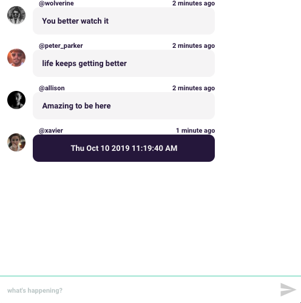

# BetterChat
Welcome to BetterChat: a chat, but a better one. Built using React, Websockets, NodeJS, express, PostgreSQL.

## Features:
* [x] Upon arriving to the page, a user is prompted to enter a new username.
* [x] The timeline supports new posts by the current logged in users in real-time using Websockets.
* [x] User messages are persisted across multiple page refreshes using an implemented RESTful API and PostgreSQL.
* [x] Every post has a TimeAgo stamp as well as a user's avatar. A click on a message reveals the time and date it was created at.
* [x] Responsive interface effectively scales with the viewport size and supports Mobile UI.
* [x] Error handling used to implement username validation logic.

To start and seed the database, 

1. Install and run PostgreSQL
2. Inside `/server/db/` Run `$ psql -f seed.db`

To start the server, inside the server directory:

1. Do `$ npm install`
2. Run `$ node app.js`

To start the client, inside the client directory:

1. Do `$ npm install`
2. Run `$ npm start`

To run tests inside client directory:

1. Run `$ npm test`
2. Press `a` to run all test

